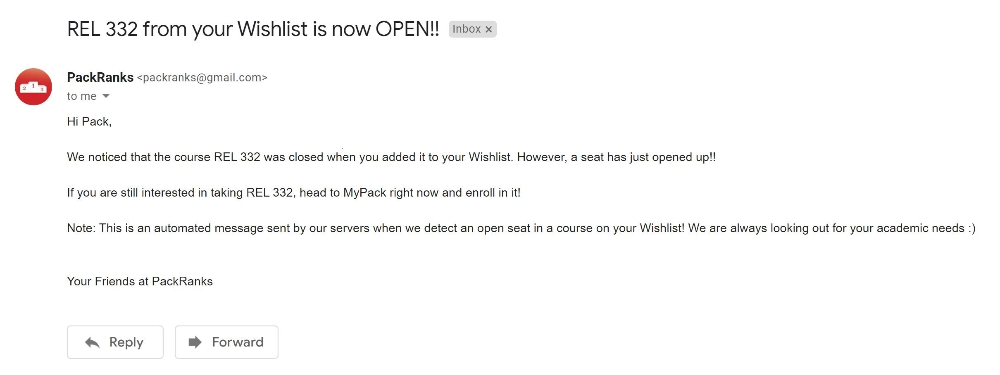

# PackRanks
This website provides a comprehensive assortment of course options for a user who is identifying a potential academic path, based on multifarious quantifiable metrics and third-party services that provide numerical professor metadata.

<strong>Project Website:</strong> http://packranks.com

<!-- TABLE OF CONTENTS -->
## Table of Contents
* [About](#about)
    * [The Problem](#the-problem)
    * [Solution](#solution)
    * [Technology Stack](#technology-stack)
    * [Conceptual Approach](#conceptual-approach)
* [Features](#features)
    * [Rank Courses by Difficulty](#rank-courses-by-difficulty)
    * [Save Prospective Courses](#save-prospective-courses)
    * [Get Notified When Seats Open](#get-notified-when-seats-open)
    * [Upcoming Features](#upcoming-features)
* [Usage](#usage)
    * [Searching for Courses](#searching-for-courses)
    * [Table](#table)
    * [Rating System](#rating-system)
    * [Wishlist](#wishlist)
* [Authors](#authors)
* [License](#license)

<!-- ABOUT THE PROJECT -->
## About

### The Problem

When students plan their courses for the upcoming semesters, there are many important factors to consider. However, <strong>pertinent information is decentralized</strong> across many resources.

North Carolina State University's course planning interface, <strong>MyPack Portal</strong>, is infamously difficult to navigate and forces students to reference multiple external sources. PackRanks addresses these shortcomings, and provides a venue for crystal <strong>clear</strong> and pristine <strong>quality</strong> information that NC State students value.

NC State undergraduates need a more extensive and easy-to-use course search tool to simplify the tedious and overcomplicated course discovery process.

### Solution
We built <strong>PackRanks</strong>, a web app that allows students to find and plan their courses for the upcoming semester, combining a comprehensive course search with a meticulous email notification service to provide up-to-date and accurate information in a <strong>convenient</strong> and <strong>practical</strong> manner.

<a target="_blank" href="http://www.packranks.com">PackRanks</a> aims to help students feel more informed and confident when choosing courses, while simultaneously aggregating an abundance of resources into a concise presentation.

### Technology Stack

#### [React](https://reactjs.org/)
   * We utilized many prevalent concepts found in professional React development, including a modular component design, ReactDOM, ReactRouter, HTTP requests, hooks, and protected routes.
   * We implemented a multitude of front-end components for viewing a course table, logging in and signing up a user, and managing their Wishlist information.
#### [Python](https://python.org)
   * We wrote custom scripts in Python and utilized libraries such as Pandas, NumPy, smtplib, json, and pymongo.
   * We connected our Flask endpoints to the front-end as well as <strong>one-off and worker dynos</strong> on Heroku in order to implement a variety of email notification and database management scripts. 
#### [Selenium](https://pypi.org/project/selenium)
   * We built an <strong>automated web crawler</strong> to obtain and monitor specific information updates 24/7.
   * We integrated our web scraping system with our MongoDB cluster and implemented a secure <strong>data communication protocol</strong>.
#### [Flask](https://pypi.org/project/Flask)
   * We implemented a <strong>RESTful API</strong>, including endpoints for user authentication and retrieval of personalized user data.
   * We preserved the integrity of our API endpoints and implemented a custom cybersecurity model using <strong>JSON Web Tokens (JWT)</strong> and session management best practices.
   * We prioritized technical documentation and software maintainability in order to simplify the process of continuous integration and deployment.
#### [MongoDB](https://www.mongodb.com)
   * We designed an advanced database model to store information on <strong>thousands of course sections</strong> across NC State.
   * We managed the merging of multiple MongoDB collections, continous updates to our database server instance.
   * We maintained a stable paradigm for our database collection set in order to manage new users and Wishlist information as well as course changes.
#### [Heroku](https://www.heroku.com)
   * We deployed our application front-end and back-end to a cloud platform using <strong>Heroku web dynos</strong>. 
   * We also launched our web-scraping script built using Selenium to run 24/7 on a Heroku worker dyno.
   * We built valuable skills in multilingual deployment configuration and compatibility using cloud computing technologies.
#### [Bootstrap](https://getbootstrap.com)
   * We used Bootstrap as an effortless method for styling PackRanks, so that we could focus on delivering the highest standard of information.
#### [Material-UI](https://material-ui.com/)
   * We envisioned a sleek and clean design, so we applied the Material-UI components and design principles in our React front-end.

### Conceptual Approach
#### Research
   * We began our research process by identifying potential academic and extracurricular needs for NC State students.
   * As members of the NC State community, we utilized our everyday experiences to highlight areas for improvement in students' <strong>academic planning.</strong>

#### Design
   * Once we pinpointed the exact need that <a target="_blank" href="http://www.packranks.com">PackRanks</a> could fill in the course planning space, we immediately collaborated on the best way to deliver a <strong>simplistic</strong> user experience.
   * We determined which websites we would need to extract data from to serve as the backbone of PackRank's <strong>comprehensive information distribution.</strong> 
   * Although at the start of our project, we had a limited knowledge of creating a full-stack project, through <a target="_blank" href="http://www.packranks.com">PackRanks</a> we all built an applied understanding of the intricacies of <strong>web scraping</strong> and web development [technologies](#built-with).

#### Test
   * Throughout the <a target="_blank" href="http://www.packranks.com">PackRanks</a> development process, we utilized strong database quality assurance methodologies as well as end-to-end testing.
   * We implemented a <strong>diabolical testing strategy</strong> that involved coverage of all test cases and endpoints so that we could diagnose exactly where any bugs were coming from. 
   * With the current release of <strong>PackRanks</strong>, we are using a <strong>crowdsourced</strong> approach to focus our attention on crucial features that most impact the user experience.  

#### Iterate
   * In future iterations of <a target="_blank" href="http://www.packranks.com">PackRanks</a>, we aim to gather as much <strong>feedback</strong> from the community as possible and integrate the NC State community's ideas with the next version of our product.
   * We have created an exhaustive <strong>Continuous Integration & Delivery (CI/CD)</strong> plan for subsequent releases of <a target="_blank" href="http://www.packranks.com">PackRanks</a>, to ensure a streamlined and convenient process for both the development team and the users.

Discover the power of <a target="_blank" href="http://www.packranks.com">PackRanks</a> in our [Features](#features) section!

<!-- describe project in detail:
    goal, audience, why we made it, what it does -->

## Features
#### Rank Courses by Difficulty
You can customize which set of courses you are looking for and view a wealth of information presented in a ranked table. Additionally, <a target="_blank" href="http://www.packranks.com">PackRanks</a> enables you to efficiently find classes that fulfill general education requirements.

 
  
 <em>Course Table</em>

#### Save Prospective Courses
You can add a course to your Wishlist to view it later, and to receive open-seat notifications. Plan your upcoming semesters' schedules, and, in the near future, simplify the intricacies of NC State degree requirements through our degree plan feature!

 
  
 <em>Wishlist</em>

#### Get Notified When Seats Open
Get an email notification whenever a seat in a waitlisted or closed class in your Wishlist becomes open. Never miss out on a notable course opportunity!

 
  
 <em>Email Notification Example</em>

#### Upcoming Features
* Degree Audit
* Class Preferences
* Mock-Scheduler

## Usage
### Searching For Courses

 
  
 <em></em>

<!-- NOTE: To force a line return, place two spaces at the end of a line (Hence why there are two spaces at the end of some lines in the Usage steps below) -->
<strong>1.</strong> Select <strong>Term</strong> that you are looking for a class in  
<strong>2.</strong> Search for <a target="_blank" href="https://oucc.dasa.ncsu.edu/general-education-program-gep/gep-course-lists-2/">GEP</a> or by course department  
<strong>3. GEP:</strong>  
&emsp;- Select GEP  
&emsp;- Choose number of courses to view  
<strong>4. Department:</strong>  
&emsp;- Search for or select department  
&emsp;- Enter course number range (or same number for a specific course)  
&emsp;- Choose number of courses to view  

### Table

 
  
 <em>Populated Table</em>

* The <a target="_blank" href="http://www.packranks.com">PackRanks</a> table displays all pertinent information regarding a group of NC State courses, including links to multiple websites providing further specific details.

#### Table Links
* <strong>Rating</strong>
    * The Rating column, sorted in descending order, displays a conclusive rating based on grade distribution data from <a target="_blank" href="https://tools.wolftech.ncsu.edu/gradient">Wolftech Gradient</a>, North Carolina State University's official source for professor and course section grading data. More information on our rating can be found in our [Rating](#rating-system) section.
<!--* Name
    * The Name column contains the name of the course listed in order to provide more information about its contents.-->
* <strong>Catalog Link</strong>
    * The Catalog Link column contains the course code (e.g. ENG 101) as well as a link to that section's NC State course catalog entry, which contains precise information such as a course description directly from the university.
* <strong>RateMyProfessor Link</strong>
    * The RateMyProfessor Link column has the name of the professor teaching the course listed, as well as a link to their <a target="_blank" href="https://www.ratemyprofessors.com">RateMyProfessor</a> profile. RateMyProfessor is a professor review site with crowdsourced data from millions of students nationwide.
<!--* Section
    * The Section column provides the unique section number for the course listed, which can be used to identify it when registering online.
* Wishlist
    * The Wishlist column consists of an option to add the course to the user's wishlist (if the user is logged in), or a link to the login page if the user is not currently authenticated.
* Prerequisites
    * The Prerequsites column contains a statement on all courses necessary to complete before taking the course listed. This information is taken directly from NC State's website, and is periodically updated.-->
* <strong>Location</strong>
    * The Location column states where the class will be taught. If the location is at an on-campus building location, the column also shows a link to the Google Maps page for that location.
<!--* Seats
    * The Seats column displays the current status of the course (whether it is open or not) as well as the current number of seats remaining. This information is constantly being scraped from NC State's official website and the table is updated accordingly.
* Times
    * The Times column displays the times the course is taught, or TBD if it has not been determined by administrators.
* Semester
    * The Semester column displays the semester for which the current section is being taught.
* Notes
    * The Notes column contains any additional information that might be relevant to the course displayed (this data is also taken from NC State's website and updated accordingly).-->

### Rating System
* We designed the <a target="_blank" href="http://www.packranks.com/about">rating system</a> to be simple for users to understand as well as to be the most <strong>accurate measure of difficulty</strong> for NC State courses.
* We use newly updated data from <a target="_blank" href="https://tools.wolftech.ncsu.edu/gradient">Wolftech Gradient</a> to compute a rating of each course that measures how easy or difficult the class is.
* We sort our course results for GEPs and specific courses by that rating, providing users with a simple and effective way to find the easiest GEPs or any courses they are looking for!

### Wishlist
* We created the Wishlist as a <strong>convenient</strong> way for users to store all the details on courses that they are interested in taking in future semesters.
* We implemented a feature that reminds a user when a closed course on their Wishlist opens a new seat! This way, users will <strong>never miss opportunities</strong> to register for class they are interested in taking.
* We are currently working on an extension to the Wishlist such that users can plan out their entire <strong>course of study</strong> simply by entering their major! This feature would combine the core functionality of <a target="_blank" href="http://www.packranks.com">PackRanks</a> with major and degree plans offered at NC State. 

<!-- CONTRIBUTING -->
## Authors

* **Ishaan Radia** - Junior at North Carolina State University studying Statistics and Computer Science. - [LinkedIn](https://linkedin.com/in/ishaan-radia) - [GitHub](https://github.com/iiradia)

* **Mathew Chanda** - Sophomore at North Carolina State University studying Computer Science - [LinkedIn](https://www.linkedin.com/in/mathewchandancsu/) - [GitHub](https://github.com/MathewChanda)

* **Harshal Suthar** - Sophomore at North Carolina State University studying Computer Science - [LinkedIn](https://www.linkedin.com/in/harshal-suthar/) - [GitHub](https://github.com/h-suthar)

* **Anthony Wang** - Sophomore at North Carolina State University studying Statistics - [LinkedIn](https://www.linkedin.com/in/anthony-wang-3aa134164/) - [GitHub](https://github.com/AndongW)

<!-- License -->
## License